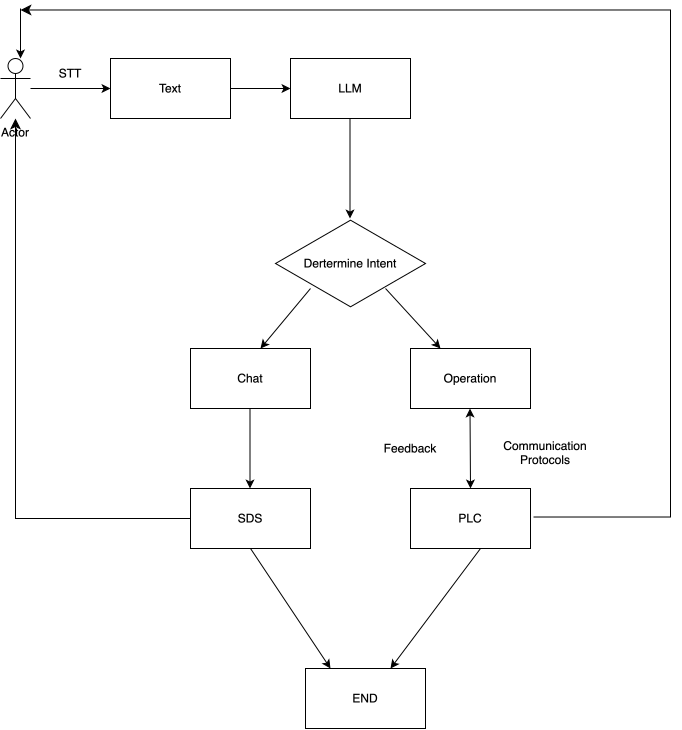
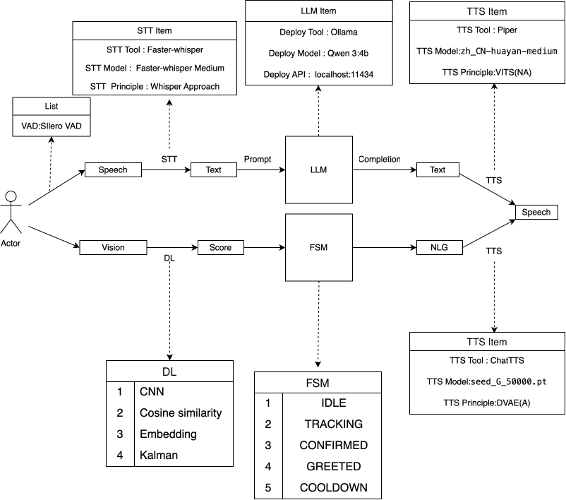
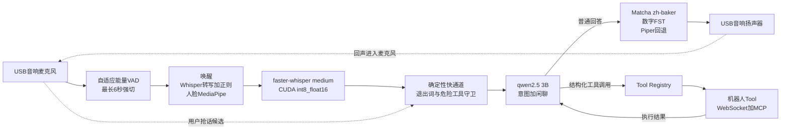

## 版本详情

### v1 — 2025 年 5-6 月

**形态**：单文件主程序 `AI_Friend.py`（约 580 行）+ 独立语音合成服务 `Low_version_server.py`（约 120 行）。

**使用的 AI 工具**：DeepSeek 客户端，走 DeepSeek Responses API。

**当时做到的功能**

- 语音唤醒（模型语义判断 + 同音字容错）
- 语音输入（录音 → VAD 分帧 → 识别成中文）
- 流式对话（逐字打印，历史消息累积）
- 语音输出（模型生成语气标签 → ChatTTS 合成 → 淡入淡出播放）
- 音乐播放控制（播放/暂停/停止/继续，随机选曲）
- 退出对话（关键词触发 + 模型生成告别语，然后 `break` 结束程序）
- 长期记忆（`memory.json` 保存用户画像并注入 system prompt）

**这一版的关键取舍**

- 为了语音自然度引入 ChatTTS，代价是必须拆出独立服务进程（依赖环境冲突）。
- 唤醒、意图、语气、告别语各写一个 prompt，都以"问模型一句、拿一句回来"的方式实现。

#### 技术栈

**运行环境**

- Python 3
- Linux（依赖 `bash` 启动外部服务脚本，见 v1 架构说明）

**语音相关**

| 库                     | 用途                                          |
| ---------------------- | --------------------------------------------- |
| `pyaudio`            | 麦克风录音，按 20ms 分帧读取                  |
| `webrtcvad`          | 人声检测（VAD），中等灵敏度                   |
| `speech_recognition` | 语音识别调用层                                |
| `pyttsx3`            | 本地 TTS 引擎（初始化备用）                   |
| `pygame`             | 音频播放，含淡入淡出、音乐播放控制            |
| `numpy`              | 音频帧的静音判断与数值处理                    |
| `wave`               | 写临时 wav 文件                               |
| `ChatTTS`            | 神经网络语音合成，独立进程运行（v1 音色方案） |
| `torch`              | ChatTTS 依赖，加载说话人音色嵌入              |
| `Flask`              | 把语音合成包装成本地 HTTP 服务                |
| `soundfile`          | 合成音频的 wav 写出                           |

**模型与网络**

| 库           | 用途                                       |
| ------------ | ------------------------------------------ |
| `openai`   | DeepSeek 客户端 SDK，走 Responses API 接口 |
| `requests` | 调用本地语音服务、探测服务是否就绪         |

**标准库**

`os`、`time`、`json`、`random`、`subprocess`（拉起外部服务）、`threading`（音乐播放线程）、`tempfile`、`re`、`datetime`

---

#### 架构

v1 是**主程序 + 本地语音服务**的两进程结构。之所以拆开，是因为 TTS 部分（ChatTTS + torch）的依赖环境和主程序冲突，需要单独跑。

```Markdown
┌──────────────────────────────────────────────────────────┐
│  主进程  AI_Friend.py                                     │
│                                                          │
│  ┌────────────────┐   ┌──────────────────────────────┐   │
│  │ 语音输入        │   │ 主对话循环                    │   │
│  │ pyaudio 录音    │──▶│  等待唤醒 → 对话中            │   │
│  │ webrtcvad 分帧  │   │  三个 if 依次过滤：           │   │
│  │ 静音判定        │   │   ① 无人声？      → continue  │   │
│  │ speech_         │   │   ② 未唤醒？      → continue  │   │
│  │ recognition     │   │   ③ 音乐意图？    → continue  │   │
│  │ 识别成文字      │   │   ④ 退出意图？    → break     │   │
│  └────────────────┘   │   都不过 → 普通聊天（流式输出） │   │
│                       └───────────┬──────────────────┘   │
│                                   │ 要说话时              │
│  ┌────────────────────────────────▼──────────────────┐   │
│  │ 语音输出  chitospeak()                             │   │
│  │  先把台词交给模型生成语气风格标签                     │   │
│  │  → HTTP POST 到本地语音服务                         │   │
│  │  → 拿到 wav → pygame 播放（带淡入淡出）              │   │
│  └────────────────────────────────┬──────────────────┘   │
│                                   │ HTTP 127.0.0.1:5001  │
└───────────────────────────────────┼──────────────────────┘
                                    │
┌───────────────────────────────────▼──────────────────────┐
│  语音服务  Low_version_server.py（Flask）                  │
│                                                          │
│  POST /speak  ← {"text": "<style>风格</style>正文"}       │
│       │                                                  │
│       ├─ 解析 <style> 标签，映射成语速/温度/采样参数        │
│       ├─ 载入固定的说话人音色嵌入（.pt 文件）               │
│       ├─ ChatTTS 推理合成                                │
│       └─ 返回 wav 音频                                   │
│                                                          │
│  由主进程通过 subprocess 调 bash 脚本拉起（launch_low_server.sh）│
└──────────────────────────────────────────────────────────┘
```

**设计要点**

1. **唤醒与意图都交给模型判断**，不做关键词匹配。唤醒判断专门处理了同音字误识别（「知识」「只是」「芝士」「姿势」都算叫它）。
2. **情绪走带内协议**：模型先生成 `<style>速度/语气/语调</style>` 标签，服务端再把它翻译成 ChatTTS 的推理参数。这样"温柔地说"这类要求不需要改代码就能生效。
3. **流式输出**：普通聊天和告别语都用 `stream=True` 逐字打印，边生成边显示。
4. **三个 if 的顺序不可调换**，代码末尾有大段注释解释这个执行顺序——这是 v1 主循环的核心约束。

**v1 已知问题**

- `is_called_by_user`、`recognizer`、`get_time`、`pygame.mixer.init()` 都有重复定义（边写边加留下的痕迹）。
- `listen_for_input` 用**音量均值**判断静音，不用已引入的 webrtcvad；`is_human_voice` 反而没被调用。
- 语音识别走 `recognize_google`，音频会上传到 Google 服务器。
- `update_memory_with_time` 定义了但从未被调用。
- 依赖外部文件 `launch_low_server.sh` 和 `ChatTTS/` 仓库，两者都不在项目目录内，单独拷贝跑不起来。

---

### V2 — 2026 年 3 月至 5 月

**形态**：在 V1 单文件基础上进行模块化拆分。当前仍是本地语音助手脚本，不是前后端分离的 Web 应用。

#### 目录结构

| 路径                    | 职责                                                             | 当前状态                                 |
| ----------------------- | ---------------------------------------------------------------- | ---------------------------------------- |
| `main.py`             | 应用入口；组织监听、唤醒判断、音乐意图处理、对话和语音播报。     | 主循环已实现                             |
| `utils/`              | 语音输入/输出、LLM 对话、上下文、记忆和音乐请求处理。            | 基础流程已实现；音乐播放仍是占位实现     |
| `clients/`            | 外部服务客户端封装；`LLM_API.py` 支持 DeepSeek 和 OpenRouter。 | 已实现                                   |
| `scripts/`            | 下载 Piper 语音模型并触发 faster-whisper 模型下载。              | 已实现                                   |
| `models/`             | Piper 本地语音模型目录。                                         | 模型由下载脚本获取，不纳入源码管理       |
| `api/`、`services/` | 预留给后续接口和服务层。                                         | 当前未使用                               |
| `wheels/`             | 预留本地 wheel 安装包或平台专用依赖包。                          | 当前未使用                               |
| `requirements.txt`    | 语音识别、音频处理和 LLM 客户端等 Python 依赖。                  | 已维护                                   |
| `clients/README.md`   | LLM 客户端说明。                                                 | 旧说明中的路径和导入示例与当前代码不一致 |

#### 主要模块

- `utils/Speech_input.py`：使用 `sounddevice` 从默认麦克风采音，通过 WebRTC VAD 检测语音片段，再用 faster-whisper 将中文语音转成文字。
- `utils/AI_related_function.py`：封装唤醒判断、用户意图判断、LLM 对话、语音文本优化和退出判断等 AI 相关逻辑。
- `clients/LLM_API.py`：从 `V2/config/LLM_api_config.json` 加载 LLM 配置，支持 DeepSeek 和 OpenRouter；配置缺失时使用空提供商默认值，不能直接完成模型调用。
- `utils/Chat_context.py`：生成初始 system 消息，并将用户记忆加入助手上下文。
- `utils/memory_manager.py`：从 `V2/data/memory.json` 读取和更新用户记忆；读取文件失败时返回空记忆。
- `utils/Speech_output.py`：使用 Piper 合成语音并通过本机音频设备播放；模型默认位于 `V2/models/piper/`，可用 `PIPER_MODEL_PATH` 覆盖。
- `utils/handle_music_request.py`：解析音乐意图并调用播放控制函数；目前这些函数只打印提示，不会实际播放或控制音乐。

#### 一次对话的调用流程

1. `main.py` 调用 `listen_for_input()` 采集麦克风音频并获得识别文本。
2. 助手尚未处于对话状态时，调用 `is_called_by_user()` 判断用户是否在唤醒助手；通过后播报唤醒回应。
3. 调用 `handle_music_request()` 判断输入是否为音乐控制请求；若是则交给对应操作处理。
4. 普通对话会追加到消息历史，并由 `get_answer()` 通过 `LLMClient` 请求模型。
5. 模型回答通过 `speak_text()` 合成为语音播放，同时在终端输出文本。
6. `goodbye_responses()` 判断用户是否结束对话；识别为结束后只会将 `is_talking` 设为 `False`，程序主循环不会退出。

整体可概括为：

```text
麦克风 -> 语音识别 -> 唤醒判断 -> 音乐意图识别及控制（控制函数仅占位）或 LLM 对话 -> Piper 合成 -> 扬声器
```

#### 运行所需的本地配置

- LLM 配置：在 `V2/config/LLM_api_config.json` 配置提供商、模型和 API 密钥；配置格式以 `V2/clients/LLM_API.py` 实际读取的字段为准。
- 用户记忆：记忆文件路径为 `V2/data/memory.json`。读取时文件不存在会返回空记忆；更新记忆前需确保 `V2/data/` 目录存在。
- 语音模型：从仓库根目录运行 `cd V2 && python scripts/download_models.py` 下载 Piper 模型，并预热下载 faster-whisper 模型。Whisper 模型名称、设备和计算类型可通过 `WHISPER_MODEL`、`WHISPER_DEVICE` 和 `WHISPER_COMPUTE_TYPE` 环境变量设置；默认配置加载失败时会回退到 CPU。
- API 密钥、个人记忆和模型权重由 `V2/.gitignore` 排除在 Git 之外。

---

### V3 -2026 年 9 月

在这个过程中得到了GPT-live的启发，也是第一次知道这个SDS叫做`级联式语音对话系统`，是比较传统的一种方式。而且顺便我也在这上面加了点工业控制。
原理图如下：第一幅图是项目原理图，第二幅是具体的SDS架构图。



不过在具体部署中,Piper太机器感，ChatTTS好像在边缘设备那里表现不好，因此又调研了一下工具链，最终做了一个还算可以的可以跑通的系统，成功完成上一年的合成太慢与GPU缺失的问题。而且额外接了一个前端展示机器人，机器人可以在屏幕上显示说话的字幕。

#### SDS 数据流与最终模型



#### 最终展示版模型清单

| SDS 环节 | 最终实际方案                                  | 是否为模型 | 为什么最终保留                                |
| -------- | --------------------------------------------- | ---------: | --------------------------------------------- |
| 音频输入 | USB 外置音响，按设备身份选择并监控拔插        |         否 | 避免麦克风                    |
| VAD      | 自适应 RMS 能量门限、静音封包、最长 6 秒强切  |         否 | 展示版已实测；Silero/TEN-VAD 仍属于下一代候选 |
| 语音唤醒 | faster-whisper 转写后按关键词唤醒逻辑近音匹配 |       部分 | 无需另装 KWS，但速度和误唤醒仍不如专用 KWS    |
| 人脸唤醒 | MediaPipe Face Detection                      |         是 | 已加入连续帧、停留时间、冷却和过期清理        |
| ASR      | faster-whisper medium，CUDA，`int8_float16` |         是 | 中文准确率和现场速度达到展示要求              |
| LLM      | `qwen2.5:3b`                                |         是 | 统一意图与聊天，只常驻一份，速度与资源较均衡  |
| 意图安全 | 正则快通道、工具前置条件、工具白名单          |         否 | 防止 3B 模型误判后直接控制真实设备            |
| TTS      | sherpa-onnx Matcha`zh-baker` + 数字 FST     |         是 | 音色优于 Piper，实时系数可接受，数字不再丢失  |
| TTS 回退 | Piper`zh_CN-huayan-medium`                  |         是 | Matcha 不可用或中英混说时可快速切回           |
| 固定话术 | 预生成`greeting.wav`、`t1_bye.wav`        |         否 | 零生成等待，避免展示时首句延迟                |
| 机器人   | WebSocket 字幕 + MCP 动作 Tool                |         否 | 与 SDS 解耦，失败时不阻塞语音主链路           |

#### 研究过但未进入最终展示版的方案

| 模块 | 候选                           | 没有作为最终版的原因                                           |
| ---- | ------------------------------ | -------------------------------------------------------------- |
| VAD  | WebRTC VAD                     | 对环境声和外放回声仍会误判，无法代替 AEC                       |
| VAD  | Silero VAD                     | 原型完成过实验，但没有完成一轮新的完整现场验收        |
| VAD  | sherpa-onnx TEN-VAD            | 完成调研，未进入展示版实机基线                                 |
| KWS  | sherpa-onnx Zipformer 中文 KWS | 方向优于 ASR 唤醒，但当时优先保证展示版稳定                    |
| ASR  | SenseVoice-Small               | 中文速度和精度资料很好，但热词支持有约束，需用自有语料实测 |
| ASR  | Paraformer / SeACo-Paraformer  | 热词能力有价值，但未完成现场整链路验证                         |
| ASR  | Streaming Zipformer            | 真流式架构候选，没有取代已经可运行的 faster-whisper 展示版     |
| LLM  | qwen3 8B                       | 质量较好，但 thinking 和整体延迟影响实时语音体验               |
| LLM  | qwen3 1.7B / 0.8B              | 意图更快，但误判率和小模型稳定性不足                           |
| TTS  | ChatTTS                        | 音色较自然，但动态生成慢；最后只用于预生成固定话术             |
| TTS  | MeloTTS                        | 实机生成速度不符合预期                                         |
| TTS  | CosyVoice2 0.5B                | 能生成，但现场认为太慢                                         |
| TTS  | Kokoro                         | 完成调研，计算量高于 Matcha，未进入展示版                      |
